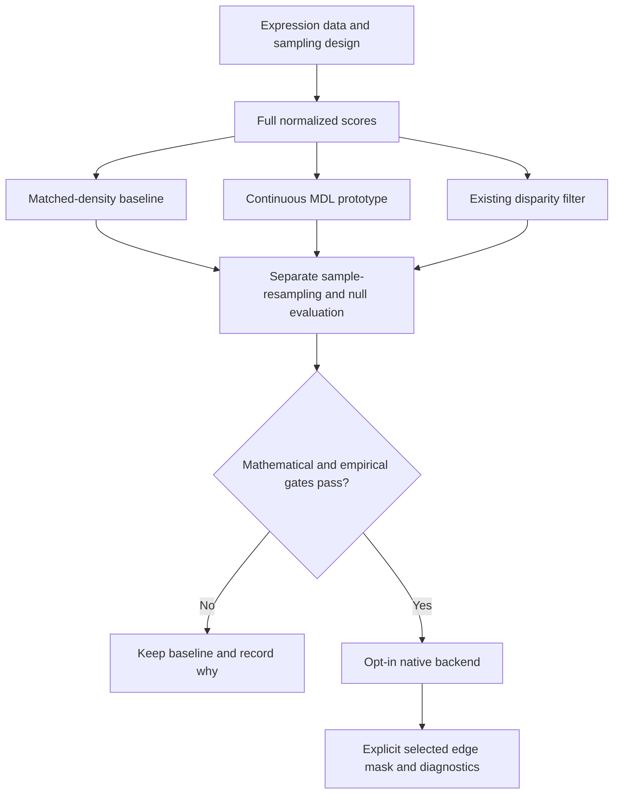

# Network sparsification: assessment and implementation plan

Date: 2026-09-15. Status: assessment complete; implementation not started.
Audience: the package maintainer and an implementing agent.

This is the operative plan for the proposal in
[mdl-engine.md](mdl-engine.md). That file is retained as historical research,
not as an implementation specification. No package behavior changes are
authorized by this document alone.

## 1. Recommendation

**Do not port PANINIpy's integer-weight MDL objective directly onto MR/CLR
networks, and do not replace the current density workflow yet.**

MDL is a credible way to choose a compact representation of a weighted graph.
It is not, by itself, a test that the retained co-expression relationships
are real, reproducible, or conserved across species. The distinction matters:
compressing a noisy or biased network can preserve its noise or bias.

For rcomplex, the best-supported next development step is a small,
reproducible comparison using expression-sample resampling and downstream
coexpressolog recovery. Include a continuous-weight MDL prototype and an
existing disparity-filter implementation as candidates. Keep matched-density
thresholding as the baseline. Promote MDL only if it adds measurable value.

This is a recommendation about what to build next, not a claim that an
unperformed benchmark has identified the winning method.

### What "best" means here

| Goal | Appropriate criterion | Recommendation |
| --- | --- | --- |
| One compact representation without a chosen density | A specified MDL weight model | Worth prototyping; not yet a default |
| Results that survive new expression samples | Sample resampling or independent replication | Primary validation criterion |
| Comparable sparsity across species | The same explicit density in each species | Retain the current workflow |
| Significant cross-species conservation | Existing reciprocal neighborhood inference and HOG tests | Keep separate from backbone selection |
| Smallest graph that remains connected | Connectivity/percolation threshold | Only if connectivity is the actual objective |

There is no assumption-free, universally optimal sparsification level.
MDL removes the analyst's density cutoff **conditional on its model**; it
does not remove choices about weight construction, priors, or the scientific
quantity to preserve. A selected graph density is also not a measure of
expression-data uncertainty.

## 2. Verified evidence and alternatives

The assessment used Kirkley's published paper, including Appendix D, the
linked PANINIpy source, current R package documentation, and primary
bibliographic records. Sources and access limitations are listed in section 9.

| Approach | Fit to this task | Important limitation | Decision |
| --- | --- | --- | --- |
| Kirkley microcanonical MDL [1, 2] | Fast automatic selection for positive integer weights | MR/CLR weights are not event counts; rounding or scaling changes the model | Reference fixtures only, not the production model |
| Kirkley continuous canonical MDL [1] | Supports real-valued weights and automatic subset selection | Requires a weight distribution and prior; continuous greedy guarantees are qualified | Experimental candidate |
| Disparity filter, via `backbone::disparity()` [3, 4] | Existing R implementation; continuous nonnegative weights; local adaptation | Still needs a significance cutoff; its weight-allocation null is not an expression-sampling null | Required low-cost comparator |
| Sample-resampling assessment; StARS as related methodology [5] | Directly tests reproducibility and includes uncertainty in network construction | More computation; resampling design and selection tolerance remain choices | Prioritize for evaluation, not an assertion of parameter-free selection |
| Correlation testing / sample-permutation nulls | Appropriate when the target is association evidence | Multiple testing, dependence, and exchangeability need care; MR/CLR scores are not correlation p-values | Null calibration and a possible later selector |
| Random matrix theory / spectral threshold diagnostics [6, 7] | Established co-expression-specific alternatives | Their spectral rationale does not automatically transfer from correlations to MR/CLR transformations | Reserve comparator if the initial candidates fail |
| Scale-free fit | Already available in rcomplex | A fitted degree distribution is not proof of biological fidelity; this is not WGCNA soft thresholding | Diagnostic baseline only |
| Spanning trees, percolation, spectral sparsifiers [1] | Useful for connectivity, routing, or operator preservation | Trees remove cycles; spectral methods may reweight edges; neither directly targets neighborhood conservation | Do not implement for this feature |

StARS was developed for regularization selection in graphical models.
Graphical-lasso edges encode conditional dependence, while rcomplex currently
uses marginal co-expression. Borrowing the resampling principle does not
justify replacing the estimator or claiming StARS's theoretical guarantees
for an MR-density grid.

The reviewed literature does not establish superiority of MDL for rcomplex's
plant comparative co-expression workflow. Kirkley's experiments support
generic graph sparsification; they are not a validation of MR/CLR-based
cross-species neighborhood inference.

## 3. Corrections to the historical proposal

1. **Continuous weights need a different objective.** The composition-count
   formula in the old note assumes positive integers. Raw MR combines ranks
   with a square root and is generally noninteger. Log-MR lies in `[0, 1]`;
   CLR is continuous and can contain zeros. Extending factorials with gamma
   functions does not establish a valid continuous probability model.
2. **Truncation changes the optimization problem.** A top-5% sparse store has
   lost the weak-weight distribution. MDL on that store is a backbone of the
   stored graph, not the complete network, even if its answer retains fewer
   than 5% of all pairs. A threshold/store guard alone cannot detect this
   statistical mismatch. Increasing the store modestly is not a proof of
   equivalence to the full graph.
3. **Local backbones are not scalar thresholds.** They may retain a weak edge
   at one node while dropping a stronger edge elsewhere. Their effective
   density is descriptive; applying that density to the original matrix
   generally yields a different edge set.
4. **Undirected bookkeeping is part of the method.** The paper models both
   directions and retains an undirected edge if either direction survives.
   Count arcs for that objective, but count unique pairs for output density.
   Preserve the original MR/CLR value once per edge. PANINIpy currently merges
   selected directions with `policy="sum"`, potentially doubling weights;
   do not inherit that behavior for rcomplex outputs.
5. **Check the exact model and search domain.** The paper's sparse search
   considers up to half the edges, or half a node's degree. The inspected
   Python code scans all prefixes. Appendix D qualifies canonical-model
   greedy optimality as asymptotic, unlike the microcanonical result in
   section II C. Do not advertise an arbitrary continuous port as an exact
   optimizer without a separate argument and exhaustive small-case checks.
6. **Empty is a valid result.** Lack of compressible weight structure is not
   an implementation failure. Do not silently keep all edges, insert a
   spanning tree, or relax the criterion. Report an explicit no-backbone
   status. This is not evidence that no biological relationships exist.
7. **Compression is not significance.** Neither description length nor its
   ratio is a p-value, q-value, or posterior probability that an edge is real.
   Python uses natural logs; the paper reports bits. Convert units explicitly.
   Continuous density-based scores also require a common precision convention
   before an absolute code-length ratio is meaningful.
8. **One species is not every species.** Independently selected MDL densities
   need not agree. The current strength API takes one reference density shared
   across species. Do not average species-specific MDL densities and present
   that average as an MDL optimum.

The full positive-score graph and a thresholded positive-score graph must
remain distinguishable. Known exact zeros may define absent edges under an
explicit positive-support model; zeros caused by discarded scores are missing
information. Do not repair either case with a hidden epsilon or rounding.

## 4. Current implementation anchors

Read these symbols, not the entire repository. Paths reflect this checkout.

| Responsibility | Existing code | Relevant symbols |
| --- | --- | --- |
| Full scores before sparse extraction | [R/network.R](../../R/network.R) | `compute_network()`, matrix method, normalization then `extract_sparse_cpp()` |
| MR score definitions | [src/mutual_rank.cpp](../../src/mutual_rank.cpp) | `mutual_rank_inplace_cpp()`, raw versus log-transformed ranks |
| Network validation and C++ dispatch | [R/network-sparse.R](../../R/network-sparse.R) | `.net_check()`, `.net_cpp_args()`, `.net_pair_sparse()` |
| Density curves and reference analysis | [R/coexpressolog-strength.R](../../R/coexpressolog-strength.R) | `.net_density_threshold()`, `.coexpr_density_profile()`, `coexpressolog_strength.default()` |
| Existing density suggestion | [R/coexpressolog-strength.R](../../R/coexpressolog-strength.R) | `suggest_reference_density()`, `.scale_free_fit_index()` |
| Downstream inference | [R/comparison.R](../../R/comparison.R), [R/summary.R](../../R/summary.R) | `compare_neighborhoods()`, `summarize_comparison()`, `permutation_hog_test()` |
| Reproducible randomness | [R/rng.R](../../R/rng.R), [R/modules.R](../../R/modules.R) | `.seed_scope()` and `.can_fork()` in the former; `.task_seed()` in the latter |
| Existing fixtures and contracts | [tests/testthat/helper-reference.R](../../tests/testthat/helper-reference.R), [tests/testthat/test-network-sparse.R](../../tests/testthat/test-network-sparse.R), [tests/testthat/test-rng-contract.R](../../tests/testthat/test-rng-contract.R) | Reference kernels, storage equivalence, RNG contract |

In particular, `.net_density_threshold()` currently lives in the strength
file, not in the sparse-network file proposed by older guidance. A dedicated
strength test file is also absent from this checkout. Verify actual symbols
and test locations before extending them; do not assume proposed files exist.

## 5. Scope and architecture

### First implementation boundary

- Development-only prototype and benchmark first. No public export, C++ port,
  Python runtime dependency, or S3 container slot in the initial experiment.
- Start from full dense scores on modest gene panels. Reject truncated sparse
  inputs for full-network MDL; never densify them and treat missing scores as
  observed zeros. Expression samples are required for resampling validation.
- Evaluate global and local MDL in the same small reference implementation.
  They share an objective evaluator, so comparing both is inexpensive here.
  Implement only the useful variant in production if one passes the gates.
- Do not change correlation/MR/CLR definitions, existing inference, clique
  weights, default densities, or the meaning of `edge_strength`.



The production insertion point, if justified, is after normalization and
before the full score matrix is discarded. This avoids recomputing
correlations just to recover data required by the selection objective.

### Proposed result contract, conditional on promotion

An opt-in `mdl_backbone()` would return an analysis result, not silently
replace a standard network. Finalize its arguments only after the model gate.

| Field | Meaning |
| --- | --- |
| `edges` | Selected unique unordered gene pairs with unchanged original weights; retain the full node ID vector separately |
| `diagnostics` | Model, optimization domain, baseline and selected objective, gain, search method, tie status, isolated-node count, effective density |
| `threshold` | A scalar only when it reproduces the selected mask exactly; otherwise `NA_real_` |
| `params` | Weight transformation, model/prior specification, input support, symmetrization, numerical conventions, implementation provenance |
| `status` | At least `selected`, `no_backbone`, or `insufficient_information` |

Use `selected_unique_edges / choose(n_genes, 2)` for effective density,
including isolated genes in the denominator. Also report retention relative
to the observed positive-support graph; these are different denominators.
If a global prefix splits a weight tie, return its mask but no scalar
threshold. Do not silently add the rest of the tie group.

Do not disguise a local mask as a standard threshold store. Such a store's
missing edges can include high original weights, breaking its current
representational contract. Any later network adapter needs an explicit
selection boundary and guards against density sweeps or reconstruction from
discarded weights. Use a development-only membership adapter for experiments;
do not send that binary adapter to weighted module consumers.

## 6. Ordered work packages

All tasks below are pending. Each task ends with its stated check before
further work. Execute sequentially; do not open production tasks before the
decision gates pass. Proposed new filenames are listed as future artifacts,
not links to files that already exist.

### T1. Establish a tiny reference and the model gate

**Artifact:** one development script, `dev/benchmark-sparsification.R`, with
reference functions and a fast `--smoke` mode. Keep exploratory helpers out
of the public namespace.

1. Implement the positive-integer objective only as a reference on tiny
   fixtures. Handle zero-edge groups explicitly; do not rely on accidental
   gamma-function cancellation. Reproduce documented, nondegenerate PANINIpy
   membership results, recording intentional search-domain and weight-output
   differences.
2. Prototype the paper's continuous exponential model with a proper prior
   on its rate. Derive the complete marginal likelihood, including the
   backbone-assignment cost and empty-group contribution. Do not copy just
   the proportional expression from Appendix D into an optimizer over sizes.
3. Record the prior scale and measurement precision as model choices. A
   development pilot may use a data-derived scale, but must label this as
   empirical Bayes, test alternative scales, and not claim parameter freedom.
   MR and CLR distributions need separate model-fit assessments; support for
   continuous numbers alone does not establish a good exponential fit.
4. Test small graphs by exhaustive subset enumeration, respecting the same
   high-weight/sparse constraints as the claimed optimizer. Compare objective
   values, not only a visually plausible edge set. Include ties, heterogeneous
   node strengths, empty optima, and low-degree local neighborhoods.
5. Demonstrate that full-network and truncated-store objectives can differ.
   Test weight-unit rescaling together with the corresponding prior-scale
   transformation. Separately test prior sensitivity and quantization
   sensitivity; do not conflate these with a units conversion.

**Check:** `Rscript dev/benchmark-sparsification.R --smoke` must stop on any
nonfinite objective, enumeration disagreement for a claimed exact method,
weight corruption, or mistaken full/store equivalence.

**Gate A:** write down a complete continuous model, endpoint behavior,
supported score types, and honest optimization guarantee. If a descending
prefix search disagrees with exhaustive optimization, either retain it as an
explicit approximation with measured error or reject it. A production claim
of exact optimization is blocked. Do not solve a model failure by multiplying
scores into pseudo-counts or adding an arbitrary epsilon.

### T2. Build the smallest fair comparison

**Depends on:** T1 for the MDL arm. The baseline and resampling evaluation can
still proceed if MDL fails Gate A. Extend the same development script.

1. Simulate expression matrices from known covariance/latent-factor models,
   including pure noise, planted conserved structure, altered structure,
   paralogs, and unequal species sample sizes. Do not use only graphs drawn
   from MDL's own generative model. Score recovery of marginal co-expression,
   not recovery of a precision graph unless explicitly running that other task.
2. Freeze the gene universe and preprocessing policy before comparisons.
   Record filtering and genes made uninformative by a split. Keep orthology
   fixed. Use identical expression resamples for every method.
3. Use a small predeclared matched-density grid, initially the existing
   example `c(0.01, 0.02, 0.03, 0.05, 0.075)`. Compare continuous MDL global
   and local, fixed-density thresholds, the existing scale-free diagnostic,
   and `backbone::disparity()` with pinned package version and explicit
   endpoint-combination and multiple-testing settings.
4. Evaluate each method's native operating point, plus density-matched
   controls where feasible. Density matching of disparity scores is a
   structural comparison, not a significance call. Keep original weights
   for selected edges and count ties consistently.
5. Use a smoke panel of a few hundred genes and a few repeats, then a pilot
   of about 1,000 genes and 20 repeats. Increase to 100 or more repeats only
   for a shortlisted candidate. These are compute budgets, not scientific
   defaults; report Monte Carlo uncertainty.

**Check:** a seeded smoke run produces identical row keys and results on
rerun, all methods see the same inputs, and absent/untestable edges are not
silently removed from only one method's comparison universe.

### T3. Evaluate the scientific objective and decide

**Artifact:** a compact methods/metrics table and decision record appended to
this plan, with a reproducible command and result location.

- Primary endpoints: known coexpressolog recovery on simulations, and
  independent-split replication of neighborhood evidence on real data.
  Report precision and recall separately; do not reward an empty graph for
  having no false positives or a complete graph for perfect repeatability.
- Resample independent biological units within species, respecting tissues,
  batches, subjects, and repeated measures. Recompute correlation and MR/CLR
  for every sample resample. Re-thresholding one fixed network is not sample
  resampling. Do not pair samples across species without a justified design.
- Report edge/neighborhood overlap at comparable density, degree and isolation
  changes, downstream reciprocal effect/rank replication, runtime, and peak
  memory. Include chance-adjusted or null-referenced overlap so density alone
  does not determine the winner. Separate backbone edges within species from
  coexpressolog edges between species.
- Use valid expression-level nulls for false-signal checks: independent
  within-gene permutations must respect exchangeability blocks. Applying one
  common sample permutation to every gene leaves correlations unchanged.
  Gene-identity or graph-rewiring nulls answer different questions.
- For real-data claims, require a representative accessible expression dataset
  and its sample metadata. Use independent validation data or an outer split
  for reporting performance after method/density selection. HOG/gene
  dependence prevents treating millions of edges as independent replicates.
- Keep model fitting and density selection blind to downstream conservation
  significance. Q-values from a selected graph do not automatically account
  for selecting that graph on the same data. Repeat the complete selection
  procedure in relevant null experiments or use held-out validation; label
  ordinary downstream inference as conditional on the selected networks.

**Gate B:** set acceptable precision/recall loss, isolation changes, and
runtime/memory budgets before inspecting the held-out results. Report paired
performance differences with uncertainty across independent simulations or
datasets. Promote a candidate only if it meets those limits and improves a
declared endpoint, such as runtime at comparable recovery. The acceptable
tradeoff is a maintainer decision, not a universal literature constant.

If no method wins clearly, retain explicit matched densities and the current
sensitivity profiles. If resampling supports a better density-selection rule,
specify that rule and its tolerance separately; do not silently call it MDL
or export a new selector as a side effect of this experiment. Without suitable
real expression data, stop at a simulation-only conclusion.

### T4. Implement only the promoted native backend

**Depends on:** explicit acceptance of Gate B. Proposed files:
`R/network-backbone.R`, `src/network_backbone.cpp`, and
`tests/testthat/test-network-backbone.R`.

- Keep validation, gene IDs, and statistical assembly in R. Reuse the network
  validation/dispatch boundary; add a separate full-support check because the
  existing threshold guard is insufficient for MDL.
- For a first opt-in dense-input API, reject lossy sparse stores explicitly.
  If fully observed sparse inputs are added, define their provenance and test
  exact parity against dense representations of the same observed graph.
- Return the result contract in section 5. Keep ties deterministic using
  stable gene IDs, independent of matrix/input ordering. Preserve isolated
  nodes and both-triangle symmetry in any sparse mask output.
- C++ operates on numeric scores and integer indices. No Python runtime,
  string maps, or extra parallel layer. Prefer the existing R implementation
  for the disparity comparator; do not port another algorithm unnecessarily.
- Target `O(E log E)` time, where `E` is the number of observed input edges,
  not the selected sparse output. A dense 20,000-gene graph has about
  200 million unique pairs and a 3.2 GB double matrix before work buffers.
- For local selection, process columns with reusable per-node sorting
  scratch. For global selection, store compact numeric weights/indices and
  running sums; avoid an R data frame or duplicated string edge list of all
  pairs. Account for reciprocal arcs without needlessly duplicating payloads.
- Use checked counts and sum ranges, stable log arithmetic, and explicit
  cancellation/overflow handling. Bound peak memory before large allocations.
  Benchmark whether a native port is needed before committing to all kernels.

**Check:** narrow reference-equivalence tests first, then a native timing and
memory comparison at two or more sizes. No performance claim based solely on
asymptotic notation. Stop if the supported input size cannot meet the budget.

### T5. Integrate without changing existing semantics

**Depends on:** T4. Touch existing pipeline code only where necessary.

- Add an opt-in call after normalization in `compute_network()` only if the
  standalone backend's memory/compute profile justifies it. Preserve the
  default path byte-for-byte where feasible and document the new result shape.
- Do not feed local effective density into `coexpressolog_strength()` as an
  equivalent reference. For an exactly threshold-representable global result,
  verify reconstruction from the proposed scalar and the current threshold
  rounding/tie convention before offering an explicit integration helper.
- Keep the matched density grid and single shared reference requirement.
  A species-specific backbone workflow is a separate analysis with its own
  interpretation, not an unnoticed extension of the existing reference API.
- Defer general mask-aware weighted consumers and a new `rcomplex` result slot
  unless separately approved. Never put a backbone result in `edge_strength`.
- Add roxygen documentation, a package news entry, and reference-index entries
  if a public function is introduced. Generate exports/docs using the package
  tools; never hand-edit generated files.

**Check:** unchanged legacy calls return unchanged results. Membership adapters
must reproduce the selected masks exactly; unsupported weighted/density
operations must fail rather than silently reinterpret discarded edges.

### T6. Required tests and release checks

Reuse nearby fixtures. Keep tiny mathematical references in the focused test
file or the existing reference helper; no external service or Python runtime
in CI. Preserve source/version provenance for any imported fixtures.

| Risk | Required test |
| --- | --- |
| Wrong continuous objective | Numerical marginalization or an independent R reference; endpoints and finite outputs |
| Incorrect optimization claim | Exhaustive tiny-graph comparisons within the declared domain |
| Weight/model mismatch | Noninteger MR, bounded log-MR, zeros, invalid values, prior and units sensitivity |
| Lost data | Truncated sparse rejection; dense/sparse equality only for genuinely equivalent observed support |
| Undirected errors | Reciprocal OR selection, unchanged weights, no double counting, isolates retained |
| Hidden threshold approximation | Non-thresholdable local example and split-weight-tie example |
| Unstable results | Input/gene-order invariance and deterministic tie handling |
| Degenerate data | Empty/uniform graph, no-backbone result, tiny/low-degree cases, invalid dimensions/names |
| RNG regressions | Seeded resampling restores state; ambient draws advance; task/core-count contract |
| Statistical regression | Existing self-excluded urn, reciprocal criterion, and reference-density behavior unchanged |

For any new exported randomized function, add it to the existing table-driven
RNG contract. No seed argument is needed for deterministic backbone selection.
Use stable task seeds for randomized batches and `.can_fork()` if forking is
ever added. Do not parallelize matrix resampling until its memory is bounded.

Run from the repository root, only once the relevant implementation exists:

```sh
Rscript dev/benchmark-sparsification.R --smoke
Rscript -e 'Rcpp::compileAttributes(); devtools::document()'
Rscript -e 'devtools::test(filter = "^network-backbone$")'
Rscript -e 'devtools::test(filter = "^(network|network-sparse|comparison|rng-contract)$")'
R CMD INSTALL --preclean .
Rscript -e 'devtools::test(); lintr::lint_package()'
Rscript -e 'pkgdown::check_pkgdown()'
R CMD build .
```

Regenerate Rcpp bindings before running native tests when exports change.
Check the resulting versioned tarball with `R CMD check --no-manual`, not
the source directory. Record baseline warnings/skips separately from new ones.

## 7. Agent handoff rules

1. Start at T1. Do not interpret the existence of later tasks as approval to
   skip the gates or to change public behavior.
2. Before editing, name one local hypothesis and its smallest disconfirming
   check. Run that check immediately after the first substantive edit.
3. Maintain one benchmark script and one focused eventual test file; reuse
   existing utilities. Do not build a framework for every sparsifier.
4. Each handoff records completed task IDs, exact commands/results, remaining
   uncertainties, files changed, and the next smallest action.
5. Stop on a scientific no-go and record it. A well-supported decision not to
   ship an MDL backend is a successful outcome of this plan.

## 8. Completion criteria

The initial development task is complete when T1-T3 yield a reproducible
go/no-go decision. A public backend is complete only after T4-T6 pass and its
scope is approved. Success is not defined as "an MDL function was added."

This planning session verified sources and implementation boundaries; it did
not fit an MDL model, run the proposed biological benchmark, or establish
which candidate wins on the user's data. The production prior/model and
acceptable biological tradeoffs deliberately remain gated decisions rather
than undocumented assumptions for an agent to invent.

## 9. Sources and provenance

1. Kirkley (2025), *Fast Nonparametric Inference of Network Backbones for
   Weighted Graph Sparsification*, Physical Review X 15, 031013.
   [Published paper](https://doi.org/10.1103/4pg6-mtmt);
   [publisher full text](https://harvest.aps.org/v2/journals/articles/10.1103/4pg6-mtmt/fulltext).
   Verified sections II A-C, III, and Appendix D. Continuous-model formulas
   must retain the terms in Eq. (7), not just Eq. (D11)'s proportional part.
   [Accessible author version](https://arxiv.org/html/2409.06417v3).
   Thank you to arXiv for use of its open access interoperability.
2. Kirkley and He (2024), PANINIpy, JOSS 9(103), 7312.
   [Paper](https://doi.org/10.21105/joss.07312);
   [inspected MDL source](https://github.com/HKU-Complex-Networks-Lab/PANINIpy/blob/2ce303e2ecb40879d5ad1af865bee8b9f5efc08a/paninipy/mdl_backboning/functions.py);
   [repository license](https://github.com/HKU-Complex-Networks-Lab/PANINIpy/blob/main/LICENSE.txt).
   The API identifies MIT licensing. The actual notice unexpectedly names
   Scott Chacon and others; preserve the supplied notice and resolve
   attribution before redistributing a port. A citation alone does not replace
   a license notice. Prefer an independent implementation of published math;
   do not copy from the separate unlicensed original repository.
3. Serrano, Boguna, and Vespignani (2009), *Extracting the multiscale backbone
   of complex weighted networks*.
   [DOI](https://doi.org/10.1073/pnas.0808904106).
   Method and assumptions also described in the verified implementation
   paper [4]. Its significance is relative to a weight-allocation null.
4. Neal (2022), *backbone: An R package to extract network backbones*.
   [Full text](https://doi.org/10.1371/journal.pone.0269137);
   [current CRAN package](https://CRAN.R-project.org/package=backbone).
   CRAN listed version 3.0.4 when checked. Inspect that version's API before
   using examples from the older paper; do not assume unchanged defaults.
5. Liu, Roeder, and Wasserman (2010), *Stability Approach to Regularization
   Selection (StARS) for High Dimensional Graphical Models*.
   [Primary record](https://europepmc.org/article/MED/25152607).
   Abstract verified through Europe PMC. Cited for the resampling/regularization
   principle, not as validation of a new MR-specific selector.
6. Luo et al. (2007), *Constructing gene co-expression networks and predicting
   functions of unknown genes by random matrix theory*.
   [DOI](https://doi.org/10.1186/1471-2105-8-299).
   Identified through the indexed references of [7]; detailed implementation
   and applicability review is deferred because this is not a first-stage arm.
7. Bleker, Grady, and Langston (2024), *A Comparative Study of Gene
   Co-Expression Thresholding Algorithms*.
   [DOI](https://doi.org/10.1089/cmb.2024.0509);
   [primary record](https://europepmc.org/article/MED/38781420).
   Title, abstract, and references verified through NCBI E-utilities. The full
   text was not accessible through the attempted PMC page; no claim about
   this study's winning algorithm is made here.
