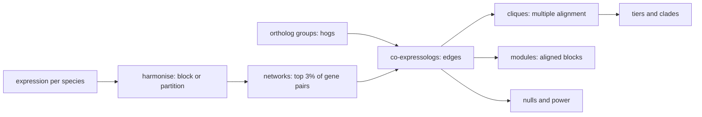

# rcomplex

<!-- badges: start -->
[](https://github.com/paliocha/rcomplex/actions/workflows/r.yml)
<!-- badges: end -->

rcomplex aligns gene co-expression networks across species, the way
BLAST aligns sequences. Ortholog groups anchor the alignment. A pairwise
alignment is a set of co-expressologs: ortholog pairs that keep their
co-expression partners. A multiple alignment is a clique: genes in three
or more species that are all co-expressed. An aligned block is a module.
Every edge gets a score, an e-value, a q-value, an effect size and a
power. The method extends ComPlEx (Netotea *et al.*, 2014).



## Install

```r
devtools::install_github("paliocha/rcomplex")
```

You need a C++23 compiler and GNU make. OpenMP is optional.

## Run

Give `rcomplex()` one expression object per species, a table of hogs,
and optional clades. The example uses four Pooideae grasses that ship
with the package.

```r
library(rcomplex)
library(SummarizedExperiment)
se <- readRDS(system.file("extdata", "pooideae_vignette.rds",
                          package = "rcomplex"))
leaf <- lapply(se[c("BDIS", "BSYL", "HVUL", "HJUB")],
               function(s) s[, s$tissue == "leaf"])
hogs <- do.call(rbind, lapply(names(leaf), function(s) {
  data.frame(species = s, gene = rownames(leaf[[s]]),
             hog = rowData(leaf[[s]])$hog)
}))
res <- rcomplex(leaf, hogs, seed = 1,
                clades = list(annual = c("BDIS", "HVUL"),
                              perennial = c("BSYL", "HJUB")))
res
#> rcomplex: 4 species, 1,500 hogs, 3 tiers
#>   BDIS  1,935 genes  20 samples  density 0.03  r >= 0.35
#>   BSYL  1,967 genes  20 samples  density 0.03  r >= 0.33
#>   HVUL  1,925 genes  20 samples  density 0.03  r >= 0.29
#>   HJUB  3,983 genes  20 samples  density 0.03  r >= 0.28
#>   edges 33,575 tested, 10,387 called at q < 0.1
#>   cliques 14,047: complete_conserved 12,592, partial_present    114, unclassified  1,341
```

Use `summary(res)` for the tier table, `write_rcomplex(res, "out/")` to
save the tables, and `rcomplex(networks = ...)` for networks built
elsewhere. Pass `block` for a designed experiment. Pass `modules = TRUE`
for modules. Pass `null = TRUE` to count calls on shuffled networks.

The quickstart runs this example step by step.

## Output

`res$edges` has one row per ortholog pair in each species pair.

| Column | Meaning |
|--------|---------|
| `gene1`, `gene2` | The two orthologs. |
| `hog` | Their ortholog group. |
| `score` | `-log2(p)`. Higher is stronger. |
| `evalue` | `n_tests * p`: pairs this strong expected by chance. |
| `q_value` | False discovery rate. |
| `effect_size` | Fold enrichment of shared partners. |
| `power` | Chance to call the pair if it were conserved. |

`res$classification` has one row per clique and its tier.

## Three pitfalls

1. **Few samples.** The density threshold keeps the top 3% of gene
   pairs at any sample size. At 20 samples that means weak
   correlations. Read `r >=` in the header. A value near 0.3 means the
   network holds a lot of chance correlation.
2. **Density.** A looser density adds edges and noise. A tighter one
   removes true edges. Run `density_sweep()` and keep the calls that
   survive.
3. **The p-value floor.** A permutation p-value cannot fall below
   `1 / (n_perm + 1)`. Trait tests over few species have a higher floor.
   Run `pvalue_resolution()` before you trust a q-value.

## Documentation

- [Quickstart](https://paliocha.github.io/rcomplex/articles/quickstart.html)
- [Walkthrough](https://paliocha.github.io/rcomplex/articles/walkthrough.html):
  every step alone, with modules and traits.
- [Methods](https://paliocha.github.io/rcomplex/articles/methods.html):
  the statistics.
- [Function reference](https://paliocha.github.io/rcomplex/reference/).

## Citation

- Netotea S, Sundell D, Street NR, Hvidsten TR (2014). ComPlEx:
  conservation and divergence of co-expression networks in *A.
  thaliana*, *Populus* and *O. sativa*. *BMC Genomics* 15:106.
  [doi:10.1186/1471-2164-15-106](https://doi.org/10.1186/1471-2164-15-106)
- Rodriguez *et al.* (2026), for the gene-graph clique taxonomy.
  [doi:10.1038/s41467-026-75624-2](https://doi.org/10.1038/s41467-026-75624-2)
